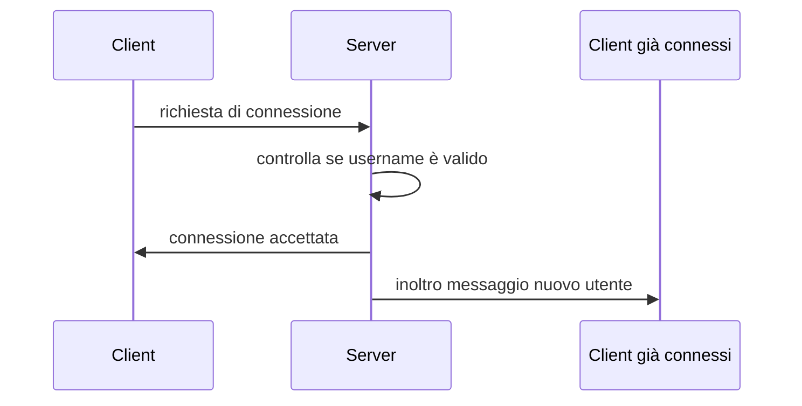

# JAVA CHAT
## Indice
- <a href="#Descrizione">Descrizione</a>
- <a href="#Strumenti">Strumenti utilizzati</a>
- <a href="#TipM">Tipologia messaggi</a>
- <a href="#Seq">Diagrammi di sequenza</a>
  - <a href="#conn">Diagramma di connessione</a>
- - <a href="#Lic">Licenza</a>

## <a name="Descrizione">Descrizione</a>
Progettazione e implementazione di una chat sviluppata in Java, basata sull'architettura Client - Server, basandosi sul protocollo TCP. Il Client e il server comunicano in modalità full duplex. La chat supporta l'invio di messaggi in broadcast sia messaggi "privati".

## <a name="Strumenti">Strumenti utilizzati</a>
- Java 18 -> Maven
- JSON 
- Visual Studio Code
- NetBeans

## <a name="TipM">Tipologia messaggi</a>
Tutti i messaggi scambiati saranno serializzati in <a href="https://www.json.org/json-it.html">JSON</a>.  
Ogni comando come riportato in tabella sottostante, è separata dal testo da `:`.  
Esempio -> `MSB:`

<table>
  <tr>
     <td>Prefisso</td>
     <td>Funzionalità</td>
   </tr>
   <tr>
   <td>MSB:</td>
     <td>Permette di inviare un messaggio in broadcast</td>
   </tr>
      <tr>
   <td>NOME_UTENTE:</td>
     <td>Specificando inizialmente il nome dell'utente permette di inviare un messaggio privatamente</td>
   </tr>
      <td>CMD:</td>
     <td>Permette di ricevere in risposta la lista di tutti i comandi accettati dal server</td>
   </tr>
      <td>ULIST:</td>
     <td>Permette di ricevere in risposta la lista di tutti gli utenti connessi</td>
   </tr>
</table>

## <a name="Seq">Diagramma di sequenza</a>
### <a name="conn">Diagramma di connessione</a>

---

## <a name="Lic">Licenza</a>
Licenza MIT

Copyright (c) [2022] [Teriaca Mattia]

L'autorizzazione è concessa, a titolo gratuito, a chiunque ne ottenga una copia
di questo software e dei file di documentazione associati (il "Software"), da trattare
nel Software senza limitazioni, inclusi, senza limitazioni, i diritti
utilizzare, copiare, modificare, unire, pubblicare, distribuire, concedere in sublicenza e/o vendere
copie del Software e per consentire alle persone a cui il Software è
fornito a tal fine, alle seguenti condizioni:

Il suddetto avviso di copyright e questo avviso di autorizzazione devono essere inclusi in tutti
copie o parti sostanziali del Software.

IL SOFTWARE VIENE FORNITO "COSÌ COM'È", SENZA GARANZIE DI ALCUN TIPO, ESPRESSE O
IMPLICITE, COMPRESE MA NON LIMITATE A GARANZIE DI COMMERCIABILITÀ,
IDONEITÀ PER UNO SCOPO PARTICOLARE E NON VIOLAZIONE. IN NESSUN CASO IL
AUTORI O TITOLARI DEL COPYRIGHT SARANNO RESPONSABILI PER QUALSIASI RECLAMO, DANNO O ALTRO
RESPONSABILITÀ, SIA IN AZIONE CONTRATTUALE, ILLECITA O ALTRO, DERIVANTE DA,
FUORI O IN RELAZIONE AL SOFTWARE O ALL'UTILIZZO O AD ALTRI RAPPORTI NEL
SOFTWARE.

