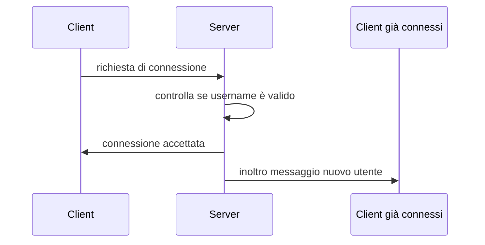
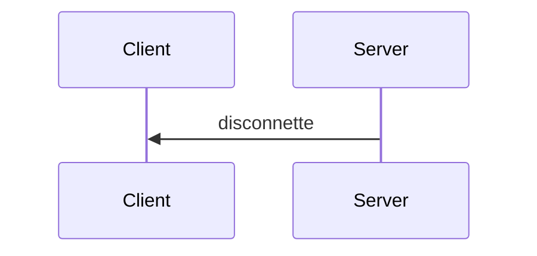
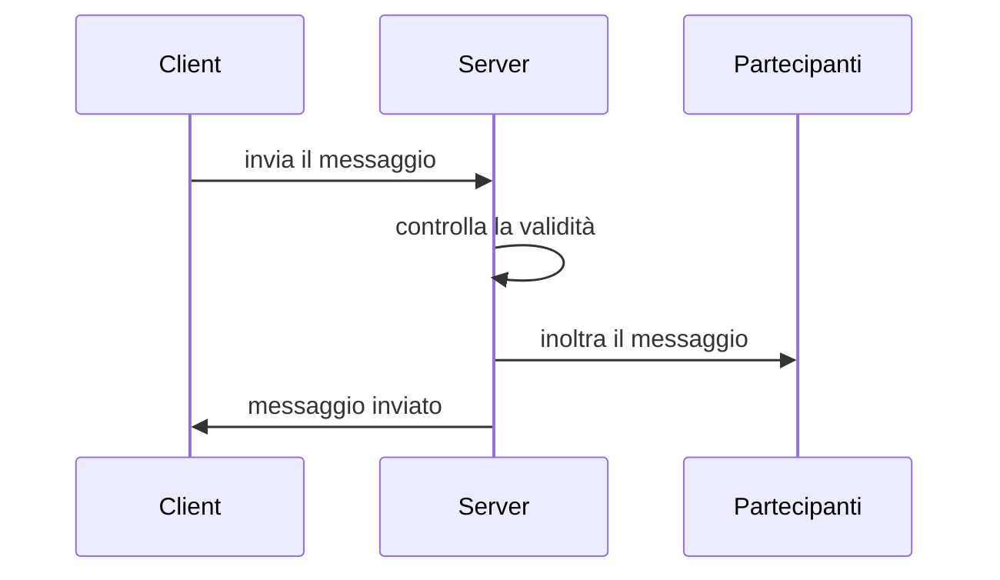
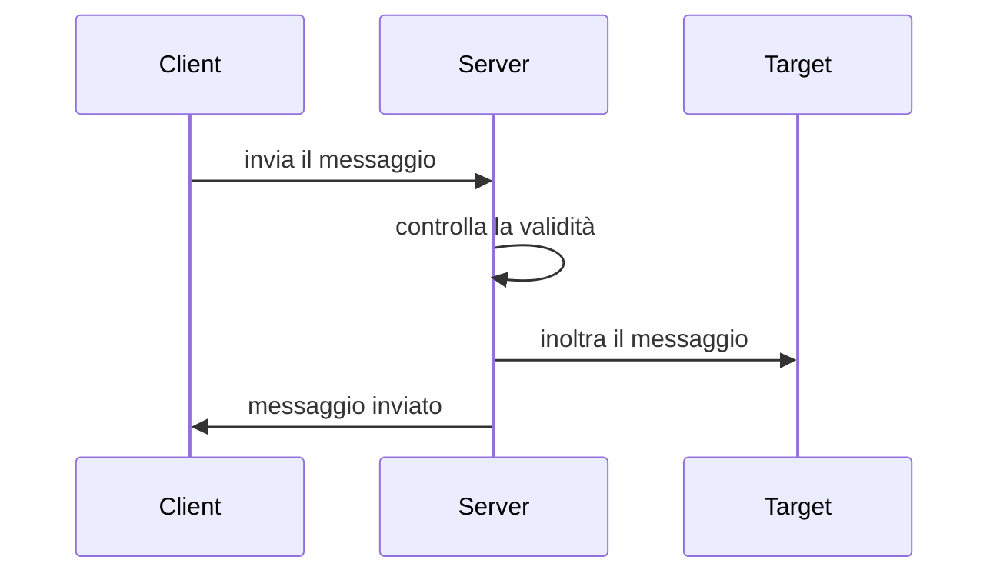

# JAVA CHAT
## Indice
- <a href="#Descrizione">Descrizione</a>
- <a href="#Strumenti">Strumenti utilizzati</a>
- <a href="#TipM">Tipologia messaggi</a>
- [Struttura messaggio](#Struttura-messaggio)
 - [Diagrammi di sequenza](#diagrammi-di-sequenza)
    - [Diagramma della connessione](#diagramma-di-connessione)
    - [Diagramma della disconnessione](#diagramma-di-disconnessione)
    - [Diagramma del messaggio pubblico](#diagramma-del-messaggio-broadcast)
    - [Diagramma del messaggio privato](#diagramma-del-messaggio-private)
 - [Licenza](#Licenza)

## <a name="Descrizione">Descrizione</a>
Progettazione e implementazione di una chat sviluppata in Java, basata sull'architettura Client - Server, basandosi sul protocollo TCP. Il Client e il server comunicano in modalità full duplex. La chat supporta l'invio di messaggi in broadcast sia messaggi "privati".

## <a name="Strumenti">Strumenti utilizzati</a>
- Java 18 -> Maven
- JSON 
- Visual Studio Code
- NetBeans

## <a name="TipM">Tipologia messaggi</a>
Tutti i messaggi scambiati saranno serializzati in <a href="https://www.json.org/json-it.html">JSON</a>.<br><br>
Ogni comando come riportato in tabella sottostante, è separata dal testo da `" "`.<br><br>
Esempio -> `@user`

<table>
  <tr>
     <td>Prefisso</td>
     <td>Funzionalità</td>
   </tr>
   <tr>
   <td>@all & senza intestazione</td>
     <td>Permette di inviare un messaggio in broadcast</td>
   </tr>
      <tr>
   <td>@user</td>
     <td>Specificando dopo la @ il nome dell'utente permette di inviare un messaggio privatamente</td>
   </tr>
  <tr>
      <td>/list</td>
     <td>Permette di ricevere in risposta la lista di tutti gli utenti connessi</td>
  </tr>
  <tr>
  <td>/close</td>
     <td>Permette di chiudere la connessione col server ed uscire dalla chat</td>
   </tr>
</table>

## Struttura messaggio
La seguente struttura rappresenta i messaggi che vengono scambiati
```json
{
 "String body" : "testo messaggio",
 "String sender" : "username mittente",
 "String receiver" : "username destinatario",
 "String tag" : "tag utilizzato dal server",
 "String ora" : "orario di invio"
}
```

## Diagramma di sequenza

### Diagramma di connessione

---
### Diagramma di disconnessione

---
### Diagramma del messaggio private

---
### Diagramma del messaggio broadcast


## Licenza
Questo software è sotto licenza MIT, consultabile al seguente [link](https://mit-license.org/)

